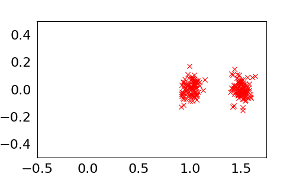

# PGPS

This is the repositry for the code of the paper **Path Guided Particle-based Sampling**. The code to reproduce the experiment results reported in the paper is uploaded in the "experiments" folder.

## Illustrative example
Here is an illustrative example showing the effectiveness of PGPS, please refer to the file example.ipynb in the root folder for the code generating this example. 

### Target

### LD over iterations

### PGPS over iterations

### PGPS evolved time t change with steps

